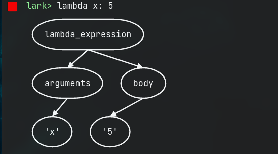
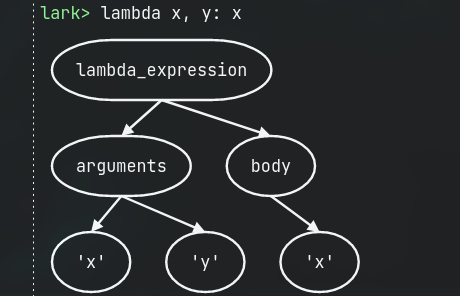
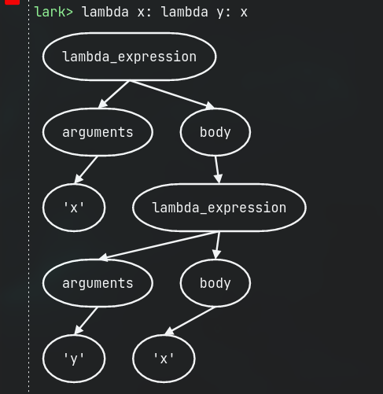
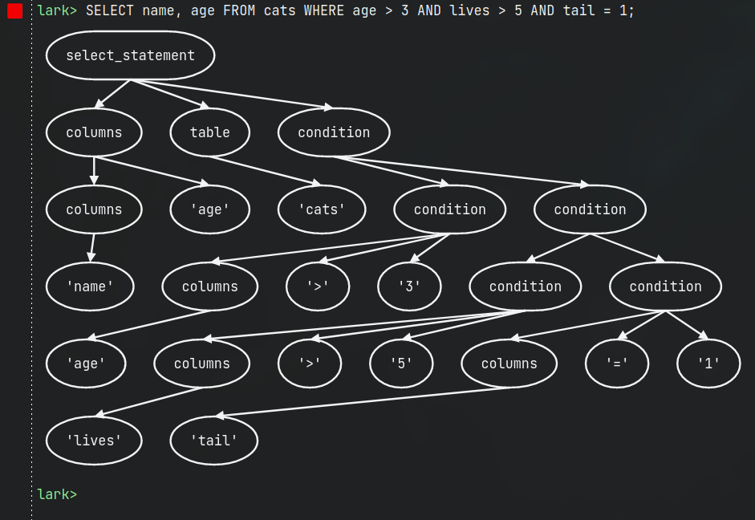

```lark
?start: lambda_expression
lambda_expression:  "lambda " arguments ":" body
arguments: WORD ("," WORD)*
body: expression
?expression: value | lambda_expression
?value: WORD | NUMBER

%import common.WORD
%import common.NUMBER
%ignore /\s+/
```







```lark
?start: select_statement
select_statement: ("SELECT" | "select") columns+ ("FROM" | "from") table ("WHERE" | "where")  condition+ ";"
columns: WORD | columns "," WORD
table: WORD
condition: columns COMPARATOR (columns | NUMBER) | condition ("AND" | "OR") condition
COMPARATOR: "<" | ">" | "=" | ">=" | "<=" | "!="

%doctest
lark> SELECT name, age FROM cats
....> WHERE age > 3 AND lives > 5 AND tail = 1;
select_statement
  columns
    name
    age
  table  cats
  condition
    age
    >
    3
  condition
    lives
    >
    5
  condition
    tail
    =
    1
%end
%import common.WORD
%import common.NUMBER
%ignore /\s+/
```


e
